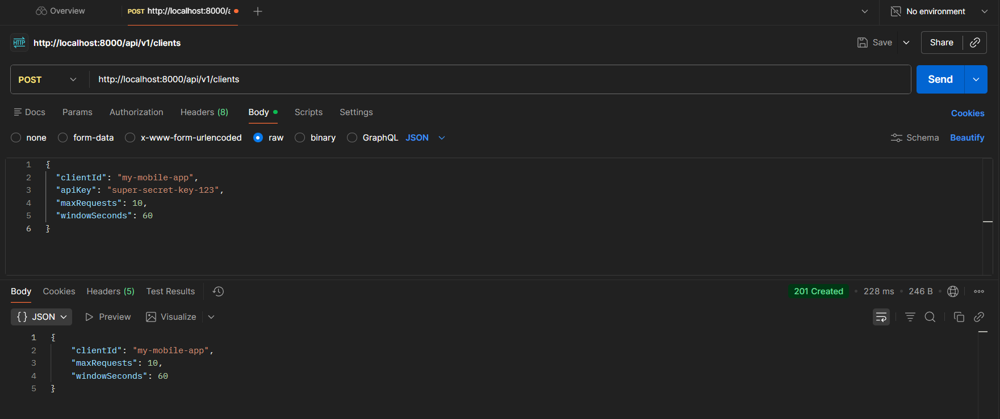
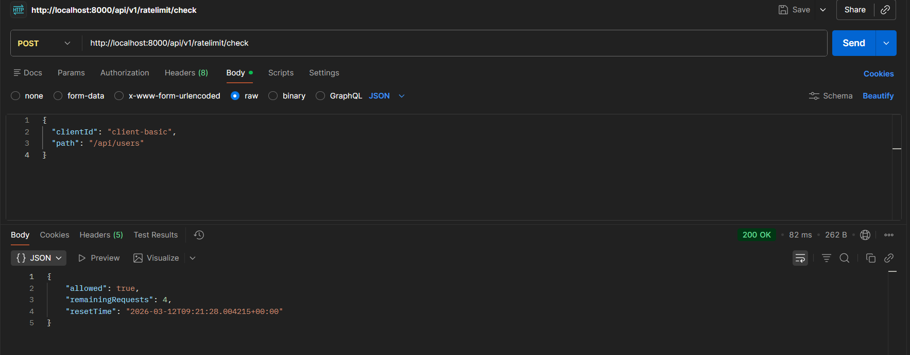
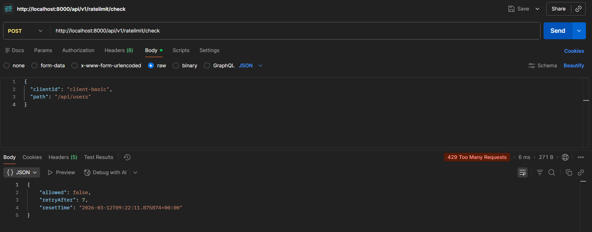
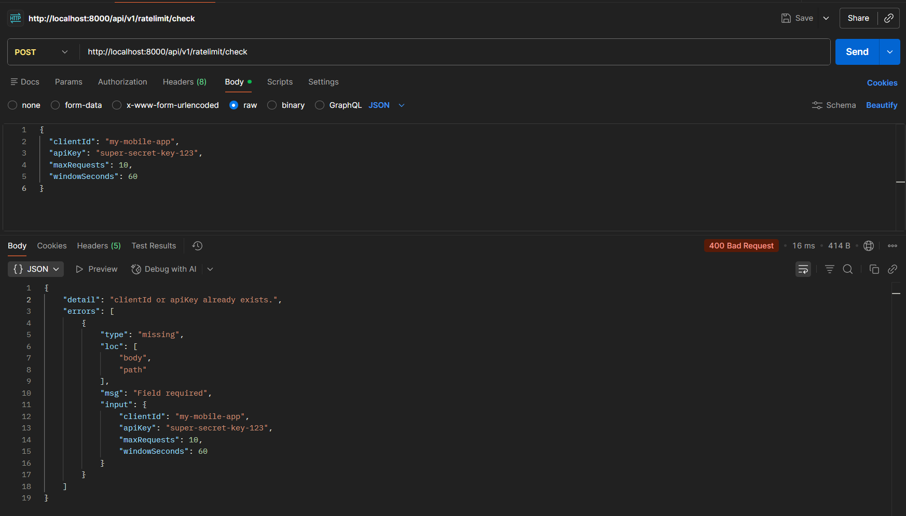

# Rate Limiting Microservice

A distributed, high-performance rate-limiting API designed to protect backend services from abuse and sudden traffic spikes. Built with **Python (FastAPI)**, backed by **Redis** for lightning-fast memory operations, and **MongoDB** for persistent client storage.

---

##  Features

- **Token Bucket Algorithm** — Allows for natural traffic bursts while strictly enforcing maximum request limits over time.
- **Distributed Architecture** — Utilizes Redis to ensure rate limits are perfectly synced across multiple instances of the API.
- **Automated Seeding** — Instantly boots up with pre-configured test clients for immediate evaluation.
- **Dockerized Environment** — True "one-command" setup utilizing multi-stage builds for a tiny, secure production image.
- **CI/CD Pipeline** — Fully automated GitHub Actions workflow for building, testing, and deploying.

---

##  Setup Instructions 

This project is fully containerized. You do not need Python, Redis, or MongoDB installed on your local machine — only Docker.

**1. Clone the repository:**

```bash
git clone https://github.com/Ravindra-Reddy27/ratelimit-service.git
cd ratelimit-service
```

**2. Create the `.env` File**

Copy the example file and create a `.env` file.

```bash
cp .env.example .env
```

 Explanation of Variables

| Variable | Description | Example Value |
|---|---|---|
| `DATABASE_URL` | MongoDB connection string used by the service | `mongodb://mongo:27017/ratelimitdb` |
| `REDIS_URL` | Redis connection string used for caching/rate limit storage | `redis://redis:6379` |
| `DEFAULT_RATE_LIMIT_MAX_REQUESTS` | Default maximum number of requests allowed per client | `110` |
| `DEFAULT_RATE_LIMIT_WINDOW_SECONDS` | Time window (in seconds) for the rate limit | `60` |


**3. Start the infrastructure:**

The `docker-compose.yml` file handles the network, volumes, database seeding, and the application build automatically.

```bash
docker compose up --build -d
```

**4. Verify the deployment:**

| Resource | URL |
|---|---|
| Interactive Swagger Docs | http://localhost:8000/docs |

---

##  Algorithm Choice & Rationale

This service implements the **Token Bucket Algorithm**.

### Why Token Bucket?

- **Burst Accommodation** — Unlike the Leaky Bucket algorithm which forces a rigid, constant output rate, Token Bucket allows temporary bursts of traffic (up to the bucket's maximum capacity). This perfectly mimics real-world API usage where a user might load a dashboard requiring 5 rapid requests, followed by minutes of inactivity.

- **Memory Efficiency** — We do not need to log the timestamp of every single request. We only store two values in Redis per client/path combination: `tokens_remaining` and `last_refill_timestamp`.

- **Distributed Safety** — By utilizing Redis Hash operations (`HMGET`, `HSET`), the math can be executed safely across multiple load-balanced API instances without race conditions.

---

##  Testing

The project includes both isolated unit tests for the core algorithm and full integration tests for the API endpoints.

To run the complete test suite inside the Docker container:

```bash
docker compose exec app python -m pytest tests/
```

> **Expected output:** `5 passed`

```bash
docker-compose exec app python -m pytest tests/integration/test_api.py
```

> **Expected output:** ` 3 passed`
---

##  API Documentation

You can view the interactive OpenAPI UI by navigating to `http://localhost:8000/docs` while the server is running. Below are the core endpoints.

---

### 1. Register a New Client

**`POST /api/v1/clients`**

Registers a new API client and safely hashes their API key before storing it in MongoDB.

**Request Body:**

```json
{
  "clientId": "my-mobile-app",
  "apiKey": "super-secret-key-123",
  "maxRequests": 10,
  "windowSeconds": 60
}
```

> `maxRequests` and `windowSeconds` are optional. If omitted, they default to the environment variable values.

**Success Response `201 Created`:**

```json
{
  "clientId": "my-mobile-app",
  "maxRequests": 10,
  "windowSeconds": 60
}
```

**Error Responses:**

- `400 Bad Request` — If the `clientId` or `apiKey` already exists, or negative values in the maxrequest and windowSeconds.

---

### 2. Check Rate Limit

**`POST /api/v1/ratelimit/check`**

Evaluates the traffic and deducts a token from the Redis bucket.

**Request Body:**

```json
{
  "clientId": "client-basic",
  "path": "/api/users"
}
```

**Success Response `200 OK`:**

```json
{
  "allowed": true,
  "remainingRequests": 4,
  "resetTime": "2026-03-12T10:15:30.123456+00:00"
}
```

**Blocked Response `429 Too Many Requests`:**

```json
{
  "allowed": false,
  "retryAfter": 12,
  "resetTime": "2026-03-12T10:15:42.123456+00:00"
}
```

---

## Running the CI/CD Pipeline

This project uses **GitHub Actions** for CI/CD. Before running the pipeline, you must configure Repository Secrets because the workflow requires environment variables.

---

### Step 1: Fork or Clone the Repository

> Push the clone repository to your own github account repo.

> Or fork the repository to your account.

---

### Step 2: Add Repository Secrets

Go to your GitHub repository and add the required secrets.

1. Open your repository on GitHub
2. Go to **Settings**
3. Click **Secrets and variables**
4. Click **Actions**
5. Click **New repository secret**

Add the following secrets:

| Secret Name | Description | Example Value |
|---|---|---|
| `DATABASE_URL` | MongoDB connection string | `mongodb://mongo:27017/ratelimitdb` |
| `REDIS_URL` | Redis connection string | `redis://redis:6379` |
| `DEFAULT_RATE_LIMIT_MAX_REQUESTS` | Default request limit | `110` |
| `DEFAULT_RATE_LIMIT_WINDOW_SECONDS` | Rate limit window in seconds | `60` |
| `DOCKER_USERNAME` | Your Docker Hub username | `your-dockerhub-username` |
| `DOCKER_PASSWORD` | Your Docker Hub password or access token | `your-dockerhub-password` |

> ⚠️ **Important:** These secrets are required for the GitHub Actions workflow to build, test, and push Docker images.

---

### Step 3: Trigger the CI/CD Pipeline

Once the secrets are added:

1. Push code to the `main` branch
2. The GitHub Actions pipeline will automatically start

```bash
git add .
git commit -m "trigger pipeline"
git push origin main
```

---

### Step 4: Monitor the Pipeline

1. Go to the **Actions** tab in your GitHub repository
2. Select the running workflow
3. View the logs for each step (build, test, docker push, etc.)

✅ After successful execution, the pipeline will:

- Build the Docker image
- Run unit and integration tests
- Push the Docker image to Docker Hub

##  Screenshots




